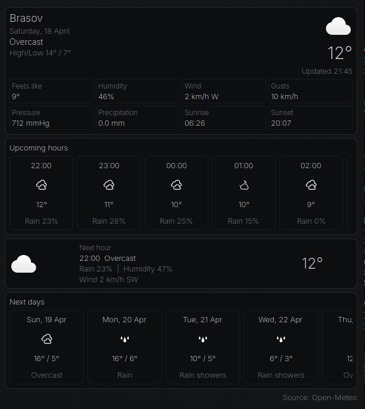

# Better Weather

A focused KDE Plasma weather widget with current conditions, upcoming hours, and next days.



## Features

- Compact panel icon with current temperature
- Detailed popup with today's summary and key weather metrics
- Upcoming hourly forecast with a selectable hour detail panel
- Next days forecast strip
- Search-based location selection in settings
- Customizable units for wind, pressure, visibility, and precipitation
- Customizable font family and font weight

## Requirements

- KDE Plasma 6
- `kdeplasma-addons`

## Installation

Clone the repository and install the plasmoid locally:

```bash
git clone https://github.com/andreicosmin02/better-weather.git
cd better-weather
kpackagetool6 --type Plasma/Applet --install .
```

If the widget is already installed and you want to update it from the repo checkout:

```bash
kpackagetool6 --type Plasma/Applet --upgrade .
```

Then add `Focused Weather` from Plasma's widget picker.

## Tests

Run the shared logic test suite with the strict coverage gate:

```bash
npm test
```

This runs the Node-based unit tests for `contents/ui/weather-logic.js` and enforces:

- 100% line coverage
- 100% branch coverage
- 100% function coverage

## Project Layout

```text
package.json
metadata.json
contents/config/config.qml
contents/config/main.xml
contents/ui/configGeneral.qml
contents/ui/main.qml
contents/ui/weather-logic.js
assets/focused-weather.png
test/weather-logic.test.cjs
```

## Data Source

Forecast data is provided by the Open-Meteo API.
